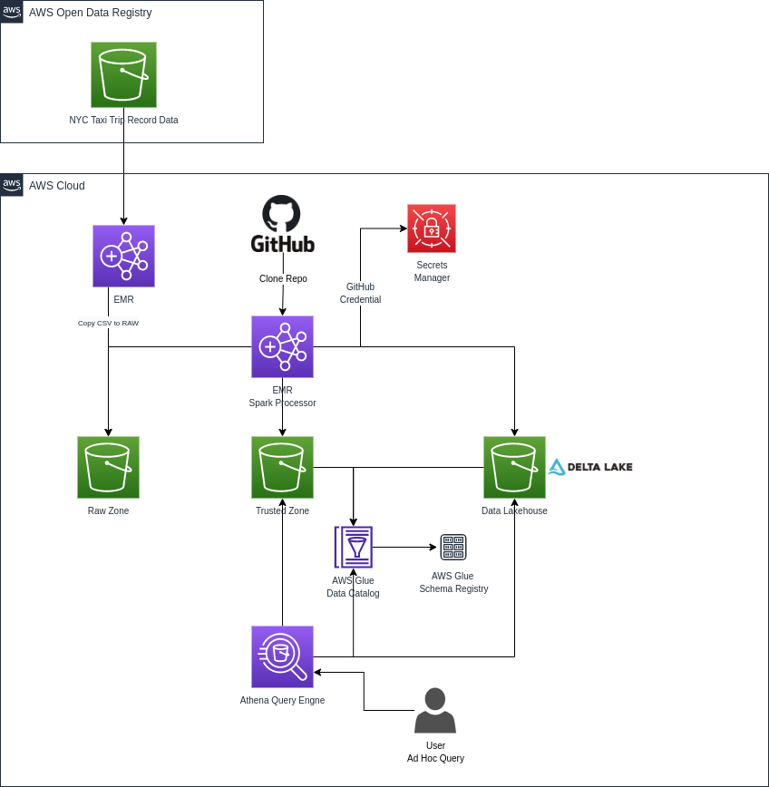

# EMR Data Processing

## Introduction

In our last post, we walked through feeding a Data Lake built on top of Amazon S3, based on streaming data, using Amazon Kinesis.

In today's post, we'll cover all steps needed to build a Data Lakehouse using as a data source the trip data from New York City Taxi, which is publicly available from the [Registry of Open Data on AWS](https://registry.opendata.aws/nyc-tlc-trip-records-pds/).

## Problem to solve

Our main goal with this solution is to provide an easy way to understand some methods involved in the ETL process, using the top-notch technologies available from AWS and the Open Source ecosystem. 

We'll ingest the data into our Data Lakehouse from a publicly available source, organize the data by applying the right data schema and some data partition techniques, processing it using Delta Lake within a centralized Data Lakehouse to provide some insights from the original data.

## Journey

Among the several ways to extract the data from the [Registry of Open Data on AWS](https://registry.opendata.aws/nyc-tlc-trip-records-pds/), we'll use a simple Python script to achieve this goal, by just copying it from its source and put into the RAW zone. 

With the original data in CSV format available in the RAW zone, we'll adjust the schema for each table, fixing data types, and field names, and turn it available for a query at the Trusted zone, organized in partitions of year and month.

In the last step, with our data organized, we'll process it again, but at this moment using a very useful Open Data Format, called [Delta Lake](https://docs.delta.io/latest/delta-intro.html), widely used by many organizations.

We will use Terraform to automate the creation of necessary resources and ensure version control.

Below we will list each used resource and its role in that context.

- Secrets Manager - Used to store the GitHub credential;
- Amazon EMR - The managed Big Data platform for running large-scale distributed data processing jobs, leveraging the strategy to spend fewer computation costs using Spot instances, in that context, we'll use it with Apache Spark;
- Amazon S3 - We'll use S3 buckets to store the data (extracted, processed);
    - Bucket: s3://nyc-tlc/ (NYC taxi data source)
    - Bucket: s3://wp-lakehouse/ (Destination bucket)
- AWS Glue Schema Registry - The repository to store and control the schemas and their versions for each object of our Data Lakehouse;
- AWS Glue Data Catalog - We'll use the Glue Data Catalog to have a unified object metastore;
- Amazon Athena - Used to query the data stored at the S3 bucket.

The diagram below illustrates the proposed solution's architectural design.

## Architecture



### Environment creation

### AWS Service deployment

To start the deployment we'll validate the infrastructure code developed with Terraform. 
If you doesn't have Terraform installed, here we'll see two approach, installing from the repository and downloading the standalone version.

```sh
# Installing from repository
$ curl -fsSL https://apt.releases.hashicorp.com/gpg | sudo apt-key add -
$ sudo apt-add-repository "deb [arch=amd64] https://apt.releases.hashicorp.com $(lsb_release -cs) main"
$ sudo apt-get update && sudo apt-get install terraform
$ terraform -version
Terraform v1.1.4
on linux_amd64


# Standalone version
$ curl -o terraform.zip https://releases.hashicorp.com/terraform/1.1.9/terraform_1.1.9_linux_amd64.zip && unzip terraform.zip
$ ./terraform -version
Terraform v1.1.4
on linux_amd64
```
Now we'll need to initialize Terraform by running `terraform init`. Terraform will generate a directory named `.terraform` and download each module source declared in `main.tf` file.
Following the best practices, always run the command `terraform plan -out=emr-processing-stack-plan` to review the output before start creating or changing existing resources.

After getting plan validated, it's possible to safely apply the changes by running `terraform apply "emr-processing-stack-plan"`. Terraform will do one last validation step and prompt for confirmation before applying. 


### Data processing using Amazon EMR

By far, the most popular storage service for a Data Lakehouse is Amazon S3. 

EMR will allow you to store the data in Amazon S3 and run PySpark applications as you need to process that data. EMR clusters can be launched in minutes. We don't have to worry about node provisioning, internal cluster setup, or other application/framework installation.

One of the most used strategies to achieve cost efficiency is using the purchasing option of Spot instances, that in many cases could represent more than 60% of savings, this will be according to the instance type and their availability within the selected AWS region.

AWS has a very good resource called [Spot Advisor](https://aws.amazon.com/ec2/spot/instance-advisor/), that helps us to identify the best instance type, this tool gives us north in terms of savings and the probability in % that our instance could be removed from the ERM because of high demand. 
This situation will occur only when someone else is intended to pay more for the selected instance type than was defined during the cluster creation, it works by defining the right value for the bid price.

### Data Ingestion

The data that is available from the NYC Taxi Trip will be transferred from their public S3 bucket preserving its original format, CSV files. We've created a logic to copy the data by providing some parameters, such as:

- Type of information to ingest, that could be trips related to yellow or green taxi and zone lookup data;
- The corresponding year of trip data, four-digit year (2022);
- The range of months to copy related trip data.

Sample execution command to execute data ingestion.

```sh
# To extract data related to yellow taxi from January to December of 2020.
spark-submit ingest_raw_data.py --type yellow --year_data 2020 --interval 1-12
 
# To extract data related to green taxi from January to December of 2020.
spark-submit ingest_raw_data.py --type green --year_data 2020 --interval 1-12
```

Data that lands inside the bucket after extraction from the source.


### Data Processing - Trusted Zone

The second step of our data preparation process consists of getting the extracted data from the RAW zone, parsing the data by applying a new well-defined schema with the right data types for each column, writing this data in parquet file format, and applying the partitioning by year and month that corresponds to the data.

Sample execution command to process data from raw zone to trusted.

```sh
# To process data related to yellow taxi.
spark-submit process_trusted_data.py --type yellow
 
# To process data related to green taxi.
spark-submit process_trusted_data.py --type green
```

By looking at how the folder structure appears inside our S3 bucket, we could see the first level of the green taxi table as the year for the corresponding chunk of data and the next level related to months.


In our architecture we are leveraging the resources of AWS Glue, in this case, our tables will be created inside the AWS Glue Data Catalog by receiving the schema definition from AWS Glue Schema Registry.

Here we could see the schema of the yellow taxi table and its definition inside the Data Catalog.


We can check the data processed by running a simple query using the Amazon Athena.


### Data Processing - Refined Zone / Lakehouse

Much similar to the processing we perform in the trusted zone, we will now make use of Delta Lake that will allow us to create a Data Lakehouse and guarantee ACID transactions, also the possibility to check the history of changes for a particular record, which we call time travel and much more.

We've created four tables that we are showing some insightful information about the trips that occurred in NYC, lets's see what each one will show us:


Our logic to process the data will create the four tables at the same time and take care of updating the [Delta files list](https://docs.delta.io/latest/presto-integration.html) used by Amazon Athena to query data efficiently.

```sh
# To process data related to Data Lakehouse.
spark-submit process_lakehouse_data.py
```

Folder structure organization of Data Lakehouse tables.


Query result using Amazon Athena.


For each one of the tables we've defined the schemas that are integrated into the Glue Data Catalog, in that way, every change will be automatically delivered to Amazon Athena.

List of all schemas available inside the Glue Schema Registry.


At last, we need to destroy our infrastructure by running the command `terraform destroy` to avoid extra costs.

Running the destroy command first asks for a confirmation and proceeds to delete the infrastructure on receiving a yes answer.

## Conclusion

Going through the approach of batch processing is one possible way to start data democratization inside companies, we can start by extracting data from selected sources and even using data that we already have from relational databases or APIs. Our suggested architecture is leveraging the existence of a public dataset to demonstrate the ETL process using EMR, S3, Glue, and Athena.

The new paradigm of the Data Lakehouse architecture is arriving to deliver more opportunities to the businesses that are planning to start their Data-Driven Journey, where now the range of technology, frameworks, and cost related to Cloud Platform is more attractive than ever.

## We think and we do!
Do you have a business that requires an efficient and powerful data architecture to succeed? [Get in touch](https://www.whiteprompt.com/contact), we can help you to make it happen!